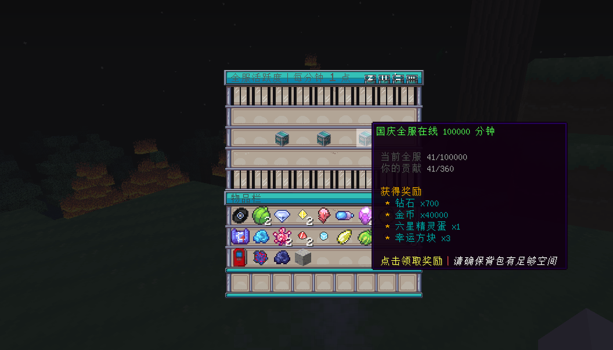

# ServerQuest
## 介绍
基于 Bukkit 开发的全服任务系统, 额外扩展 PixelmonReforged 模组。

## 功能
* 界面的高度自定义性
* 高定制性的文本词条
* 全服进度要求/个人进度要求
* JavaScript 语法条件(支持 PlaceholderAPI)

## 任务类型
* ONLINE = 在线时长
* BEAT_WILD_PIXELMON = 击败野外精灵(PixelmonReforged)
* PLAYER_BATTLE = 玩家与玩家对战结束(PixelmonReforged)
* NORMAL_CAPTURE = 玩家捕捉精灵, 普通捕捉(PixelmonReforged)
* RAID_CAPTURE = 玩家捕捉精灵, 极巨洞穴捕捉(PixelmonReforged)
* RAID_WIN = 玩家极巨洞穴对战胜利(PixelmonReforged)
* LEVEL_UP = 玩家精灵升级(PixelmonReforged)

## 更新计划
- [ ] 支持 MySQL/SQLite 存储数据

## 问题反馈
[GitHub](https://github.com/Blank038/ServerQuest/issues)  
[Email](mailto:admin@mc9y.com)  
[Telegram](https://t.me/hy12138)